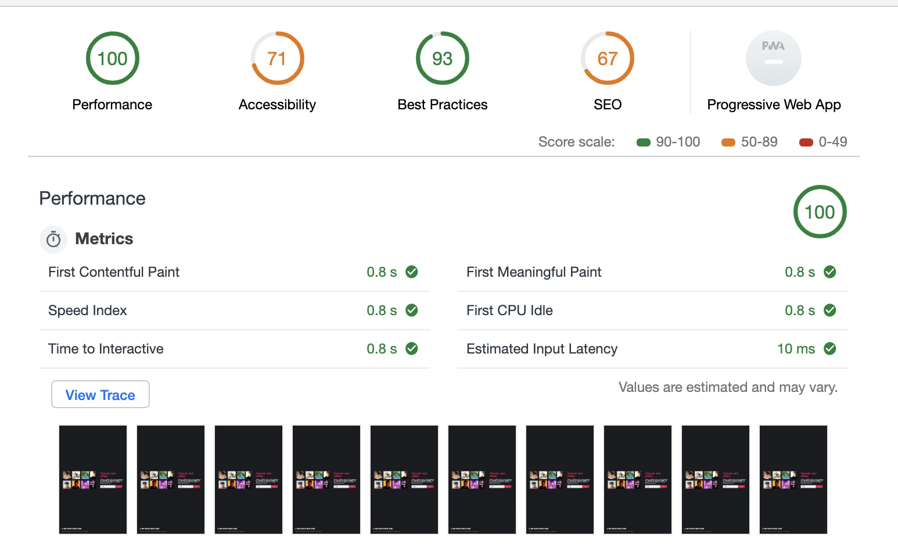

# Performance matters

First I created my OBA app with a different theme, because the OBA was kinda a hard API to actually get right I decided to build it again with artist and than on the server instead of the client.

It makes use of the [Last.fm](https://www.last.fm/api) API. Where you can get recomonneded artist.

## Goal

The goal is to get the first time you visit the page blazingly fast, I used different techniques as stated here and showing the different examples what they did to my app and how I tried to increase it.

### Minify

Used gulp for minify my static javascript
Used node-sass to minify the sass to css compressed

Both can be run with `npm run minify`

##### CSS


#### JS


**Conclusion:** Well.. my files are really small it does some minification and as the files grow bigger it can help mnuch more.

### HTTP Caching

Well it speaks for itselfs when you cache your files

Easiliy done with some middleware with express

```js
app.use(
  express.static(__dirname + '/dist', {
    maxAge: '365d',
    lastModified: '',
    etag: ''
  })
)
```

#### Without cache


#### With cache


**Conclusion:** as you can see all the files are stored in the cache. For the first request it doesn't really matter at all. But when the visitor returns it has a year the files in the cache and can load it instantly (1ms) the files.

#### Handlebars caching

As they say themselves they use a 'a smart template caching strategy`.
Sadly it doesn't have much documentation about it and I still need to figure out what it does exacly. [Link to docs.](https://www.npmjs.com/package/express-handlebars#template-caching)


**Conclusion:** I really don't have a idea why it's slower than without it. But it's hard to test and maby it has something to do with production mode? Don't know honestly...

#### Revisioning

I used [gulp-rev](https://www.npmjs.com/package/gulp-rev) --> currently a little broking :)

#### Compression

I used for pre compression the libary [bread-compressor-cli](https://www.npmjs.com/package/bread-compressor-cli) on my build. Than when the server gets the headers for the requested file I send them the usual or the compressed gzip or brotli all handeled by [shrinkray](https://www.npmjs.com/package/shrink-ray). But honestly it is not a waterproof solution and fails alot of times, I find it much easier to use the compression tool to gzip from [node compression](https://github.com/expressjs/compression)

#### Images WEBP format

It is significant faster to render these images, I converted them before on the server so it doesn't have to convert them in the page render. This is on slow 3g.

##### PNG


##### WEBP


#### Image preview

So the content doesn't spring around when the image is loaded


#### Serviceworker

I was totally new to the server workers story and had no experience at all with it. So I started with the images on the homepage importing htem from the service worker cache and also the HTML. Since it is currently not chaning I could a result of first paint in 17ms when you are already a returning visitor.

But I still feel I can optimalize it way more. But since the lack of time I coudn't figure out.

##### Job story

As a user when my internet is offline I still wanna see all my recent searches with the results I got when I was online.

As a user I wanna listen a song offline or a snipppet from a artist I found during the explorer.
(possible a good try to use backsound sync when the user is doing nothing, just for test purposes!)


# Did I achieve my goal?

I learned alot for trying and using them, but since what I did is trying so many things and just doing it stuff gets sometimes messy and you need a good goal what you wanna achieve, based on the first version I have it is a big improvement.

My old audit, based on the audit is was already quite fast since there was little to no content. Still I tried to update everything I possible could.


New audit


